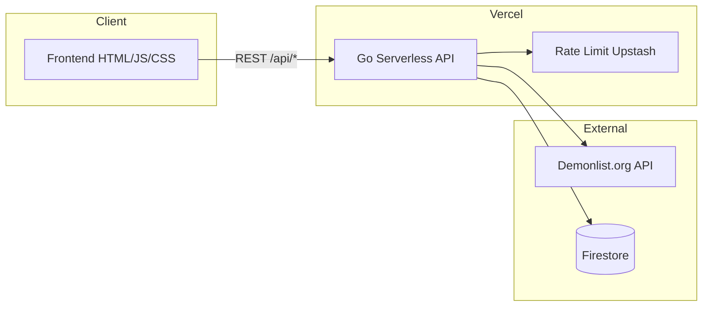

<div align="center">

# SMLT Demonlist

**Лидерборд, стафф-роли и хаб коллабов сообщества SMLT в Geometry Dash**

Актуальная статистика с [Demonlist.org](https://demonlist.org), трекер коллабов и защищённая панель хоста — в одном веб-приложении.

<br>

[](https://smltdemonlist.vercel.app)
[](https://smltdemonlist.vercel.app/leaderboard.html)
[](https://smltdemonlist.vercel.app/projects.html)

<br>


[Содержание](#содержание) · [Возможности](#-возможности) · [Архитектура](#-архитектура) · [Разработка](#-для-разработчиков) · [Discord](https://discord.gg/VK56W7ZzdA)

</div>

---

## О проекте

**SMLT Demonlist** — официальный веб-сайт Discord-сообщества **SMLT**: ивенты, коллабы, турниры и прохождения уровней в Geometry Dash. Сайт показывает прогресс участников в глобальном рейтинге и помогает координировать совместные уровни.

| Страница | Что внутри |
|----------|------------|
| [Главная](https://smltdemonlist.vercel.app/) | О сообществе, ссылки, вход хоста |
| [Демонлист](https://smltdemonlist.vercel.app/leaderboard.html) | Топ игроков, рекорды, hardest, флаги стран |
| [Проекты](https://smltdemonlist.vercel.app/projects.html) | Коллабы: роли, статусы, участники, превью |

> Первый заход на демонлист может занять **30–60 секунд** — данные подтягиваются с внешнего API для каждого игрока.

---

## Содержание

- [Возможности](#-возможности)
- [Стек](#-стек)
- [Архитектура](#-архитектура)
- [Структура репозитория](#-структура-репозитория)
- [Для разработчиков](#-для-разработчиков)
  - [Быстрый деплой](#быстрый-деплой-на-vercel)
  - [Переменные окружения](#переменные-окружения)
  - [Upstash](#upstash-redis-rate-limit)
  - [Firebase](#firebase--firestore)
  - [Локально](#локальная-разработка)
  - [API](#api)
- [Безопасность](#-безопасность)
- [Устранение неполадок](#устранение-неполадок)
- [Участие и контакты](#-участие-и-контакты)
- [Лицензия](#-лицензия)

---

## ✨ Возможности

### Демонлист

- Автоматический **лидерборд** по списку игроков сообщества
- Очки, **hardest**, рекорды и **флаги стран** из [api.demonlist.org](https://api.demonlist.org)
- **Топ уровней** с прогрессом и фильтрами
- Профили игроков без перезагрузки страницы

### Проекты SMLT

- Карточки коллабов с ролями: `HOST`, `DECO`, `GP`, `PLAYTEST`, `VERIFIER` и др.
- Статусы, комментарии, список участников
- Редактирование доступно только **хосту** (админу сайта)

### Интерфейс и админка

- Тёмная и светлая **тема**
- Адаптивная вёрстка под телефон и десктоп
- Вход **Хоста**: пароль → JWT в **HttpOnly**-куке → управление игроками и проектами в Firestore
- Тосты и плавные переходы состояний

---

## 🛠 Стек

| Слой | Технологии |
|------|------------|
| **Backend** | Go 1.26, Vercel Serverless (`api/index.go`) |
| **База данных** | Google Cloud Firestore |
| **Авторизация** | JWT (HS256) + bcrypt + IP-привязка + CSRF |
| **Rate limiting** | Upstash Redis REST (прод) / in-memory (fallback) + exponential backoff |
| **Frontend** | Vue 3, HTML, CSS, Vanilla JS |
| **Алерты** | Discord Webhooks (worker pool, buffered channel) |
| **Внешние API** | Demonlist.org |
| **Хостинг** | Vercel |

---

## 🏗 Архитектура



**Поток данных лидерборда:** браузер → `/api/leaderboard` → для каждого ника запросы к Demonlist → JSON на фронт → таблица и профили.

---

## 📁 Структура репозитория

```
SMLT-Demonlist/
├── api/
│   └── index.go           # Роутинг, auth, Firestore, leaderboard, security alerts
├── cmd/
│   └── server/
│       └── main.go        # Локальный dev-сервер
├── Frontend/
│   ├── src/
│   │   ├── api/           # Модули: auth, staff, projects, leaderboard, utils
│   │   ├── components/    # Vue-компоненты: AppShell, HomePage, LeaderboardPage и др.
│   │   ├── store.js       # Реактивное состояние
│   │   └── main.*.js      # Точки входа (home, leaderboard, projects, staff)
│   ├── index.html
│   ├── leaderboard.html
│   ├── projects.html
│   ├── staff.html
│   └── styles.css
├── Secret/                # (gitignored) serviceAccountKey.json, .env.local
├── docs/
│   └── screenshots/       # (опционально) для README на GitHub
├── vercel.json
├── go.mod
└── README.md
```

---

## 👩‍💻 Для разработчиков

Ниже — всё необходимое, чтобы **форкнуть**, **задеплоить свой инстанс** или **внести правки**.

### Требования

- [Go](https://go.dev/dl/) 1.26+
- [Vercel CLI](https://vercel.com/docs/cli) (для локального запуска)
- Аккаунты: [Vercel](https://vercel.com), [Firebase](https://firebase.google.com), [Upstash](https://upstash.com) (рекомендуется)

### Быстрый деплой на Vercel

1. **Fork** репозитория → **Import** в Vercel.
2. **Environment Variables** — см. [таблицу](#переменные-окружения) (минимум три обязательные).
3. **Deploy** → проверка:
   - `/leaderboard.html` — таблица грузится
   - `/api/players` — JSON, не HTML
   - вход **Хост** — `{"success":true}`

После смены переменных: **Deployments → Redeploy**.

```bash
git clone https://github.com/YOUR_USERNAME/SMLT-Demonlist.git
cd SMLT-Demonlist
# настройте env в Vercel, затем:
git push origin main
```

### Переменные окружения

**Vercel → Project → Settings → Environment Variables → Production**

#### Обязательные

| Переменная | Описание |
|------------|----------|
| `JWT_SECRET` | Секрет JWT, ≥ 32 символа (`openssl rand -hex 32`) |
| `ADMIN_HASH` | Bcrypt-хеш пароля хоста |
| `FIREBASE_CREDENTIALS` | JSON service account Firebase (одной строкой) |

#### Рекомендуемые

| Переменная | Описание |
|------------|----------|
| `UPSTASH_REDIS_REST_URL` | REST URL Upstash |
| `UPSTASH_REDIS_REST_TOKEN` | REST token Upstash |
| `DISCORD_SECURITY_WEBHOOK` | URL Discord webhook для security-алертов (создать в Channel Settings → Integrations → Webhooks) |

#### Опциональные

| Переменная | Описание |
|------------|----------|
| `TRUST_PROXY` | `true` — доверять `X-Forwarded-For` (на Vercel также при `VERCEL=1`) |
| `DISCORD_GUILD_ID` | ID Discord сервера для синхронизации ролей (нужен `DISCORD_BOT_TOKEN`) |

#### Генерация `ADMIN_HASH`

```bash
go run tools/hash.go "ваш_надёжный_пароль"
```

Скопируйте `$2a$10$...` в `ADMIN_HASH`. **Не коммитьте** пароль и `.env.local`.

### Upstash Redis (rate limit)

На Vercel in-memory лимит **не защищает** между инстансами — нужен Upstash.

1. [console.upstash.com](https://console.upstash.com) → **Create Database**
2. **Name:** `smlt-demonlist-ratelimit`
3. **Primary Region:** как у Vercel Functions (EU/US)
4. **Eviction:** Off · план **Free**
5. **REST API** → URL и token → переменные в Vercel → **Redeploy**

| Endpoint | Лимит |
|----------|--------|
| Все `/api/*` | 30–60 req/min на IP |
| `/api/login` | 5 req/min на IP + CAPTCHA |
| Honeypot-пути | Немедленная блокировка токена + алерт в Discord |

### Firebase / Firestore

1. Firebase Console → Firestore → Service Account → **Generate key**
2. JSON → `FIREBASE_CREDENTIALS` на Vercel

| Коллекция | ID документа | Назначение |
|-----------|--------------|------------|
| `players` | имя игрока | Список для лидерборда |
| `projects` | id проекта | Коллабы |

Если Firestore пуст: **GET** leaderboard/players работает с дефолтным списком. **POST/DELETE** требуют рабочую БД.

### Локальная разработка

Секреты остаются локальными и не должны попадать в репозиторий.
`Secret/` и `.env.local` игнорируются в `.gitignore`, поэтому их можно хранить только на своём компьютере.

`.env.local` в корне (в `.gitignore`):

```env
JWT_SECRET=dev-secret-at-least-32-characters-long
ADMIN_HASH=$2a$10$...
FIREBASE_CREDENTIALS={"type":"service_account",...}
UPSTASH_REDIS_REST_URL=https://....upstash.io
UPSTASH_REDIS_REST_TOKEN=...
```

```bash
vercel link
vercel dev
```

- http://localhost:3000/index.html  
- http://localhost:3000/leaderboard.html  
- http://localhost:3000/projects.html  

```bash
cd api && go build .
```

### API

База: `https://<домен>/api` · ошибки: `{"error":"..."}` · тело JSON ≤ **1 MB**

| Метод | Путь | Auth | Описание |
|-------|------|:----:|----------|
| `POST` | `/api/login` | — | Вход хоста, кука `auth_token` |
| `POST` | `/api/logout` | — | Выход, чёрный список токена |
| `POST` | `/api/auth/refresh` | 🍪 | Тихое обновление JWT (если <1ч до истечения) |
| `GET` | `/api/verify` | 🍪 | Проверка JWT |
| `GET` | `/api/csrf-token` | — | Получение CSRF-токена |
| `GET` | `/api/leaderboard` | — | Данные Demonlist по игрокам |
| `GET` | `/api/players` | — | Список ников |
| `POST` | `/api/players/save` | 🍪🔑 | Сохранить список |
| `POST` | `/api/players/delete` | 🍪🔑 | Удалить игрока |
| `GET` | `/api/projects` | — | Проекты |
| `POST` | `/api/projects/save` | 🍪🔑 | Сохранить проекты |
| `GET` | `/api/staff` | — | Стафф-роли |
| `POST` | `/api/staff/save` | 🍪🔑 | Сохранить роли |
| `POST` | `/api/staff/sync-discord` | 🍪🔑 | Синхронизировать роли из Discord |
| `GET` | `/api/captcha` | — | Генерация CAPTCHA |

> 🍪 = требует куку `auth_token` · 🔑 = требует admin knock key

```bash
curl -X POST https://smltdemonlist.vercel.app/api/login \
  -H "Content-Type: application/json" \
  -d '{"password":"***"}' -c cookies.txt
```

---

## 🔒 Безопасность

### Аутентификация и сессии

- Пароль хоста хранится как **bcrypt** (`ADMIN_HASH`, cost 10)
- JWT (HS256) с **IP-привязкой**: при смене IP токен автоматически блокируется
- Куки `auth_token`: **HttpOnly**, **Secure**, **SameSite=Strict**, префикс `__Host-`
- **CSRF** — двойная отправка cookie (токен в `HttpOnly`-куке + заголовок `X-CSRF-Token`)
- **Автоматическое обновление токена** — фронтенд молча обновляет JWT каждые 30 минут
- Чёрный список токенов (`token_blacklist` в Firestore) с TTL 24 часа

### Защита от взлома

- **Honeypot-ловушки** — 40+ фейковых путей (`/api/admin`, `/.env`, `/wp-admin`, `/phpmyadmin`, `/api/debug` и др.), которые логируют IP и User-Agent атакующего и немедленно блокируют украденный токен
- **Экспоненциальный бэк-off** — повторные нарушители получают прогрессивные блокировки (1 мин → 5 мин → 30 мин)
- **COOP/CORP/COEP** — защита от cross-origin атак и Spectre
- **Permissions-Policy** — отключены камера, микрофон, геолокация, платежи

### Rate Limiting

- **Upstash Redis** (прод) / in-memory (fallback)
- 30–60 req/min на IP для общих эндпоинтов
- 5 req/min на `/api/login` с обязательной CAPTCHA
- **Exponential backoff** для повторных нарушителей

### Мониторинг

- **Discord webhook-алерты** в реальном времени (цветные embeds на русском)
- **Security event log** — все события (вход, honeypot, смена IP, rate limit) пишутся в Firestore
- **Аудит-лог** — все действия хоста записываются в `audit_log`
- Worker pool для алертов (буфер 300, rate limit 4.5 req/s — без блокировки сервера)

### Валидация и санитизация

- JSON: `DisallowUnknownFields`, лимит тела 1 MB
- Все строковые данные очищаются через **bluemonday** UGCPolicy
- Регулярные выражения для ID проектов, видео, ников, Discord-тегов, цветов
- **Нет `innerHTML`** для пользовательских данных на фронтенде
- CSP: `default-src 'self'`, `frame-src https://www.youtube.com`

Нашли уязвимость — свяжитесь с командой безопасности напрямую (Discord **@rimix.98**). Не создавайте публичных Issue.

---

## Устранение неполадок

| Симптом | Решение |
|---------|---------|
| «Некорректный ответ» при входе | `JWT_SECRET`, `ADMIN_HASH`; `/api/login` должен отдавать JSON |
| Пустой лидерборд | Подождать 30–60 с; проверить `/api/leaderboard` |
| `База данных недоступна` | `FIREBASE_CREDENTIALS`, Firestore включён |
| 429 Too Many Requests | Подождать 1 мин; не брутфорсить `/api/login` |
| HTML вместо JSON на `/api` | Vercel → Logs → Functions |
| Сессия сбрасывается при входе | JWT привязан к IP — смена WiFi/cellular требует повторного входа |
| Honeypot-срабатывания в Discord | Автоматический сканер бота — можно игнорировать |

---

## 🤝 Участие и контакты

### Сообщество

- **Discord:** [discord.gg/VK56W7ZzdA](https://discord.gg/VK56W7ZzdA)
- **Живой сайт:** [smltdemonlist.vercel.app](https://smltdemonlist.vercel.app)

### Как помочь проекту

1. **Star** репозитория — если проект полезен сообществу
2. **Fork** → правки → **Pull Request** с понятным описанием
3. **Issues** — баги и идеи (шаблон: что ожидали / что получили / скрин или URL)

### Команда

| Роль | Контакт |
|------|---------|
| Admin / сообщество | Discord **@.samoletik** · Telegram **@samoltik** |
| Backend & security | Discord **@rimix.98** |

---

## 📄 Лицензия

Исходный код открыт для просмотра и изучения. Коммерческое использование, форки публичных инстансов и распространение — **с согласования** с администрацией SMLT (Discord выше).

При публикации на GitHub рекомендуется добавить файл `LICENSE` (например MIT или Apache-2.0), если сообщество решит формализовать права.

---

<div align="center">

**SMLT** — Geometry Dash · коллабы · ивенты · удовольствие от игры

[⬆ Наверх](#smlt-demonlist)

**Последнее обновление:** июнь 2026

</div>
