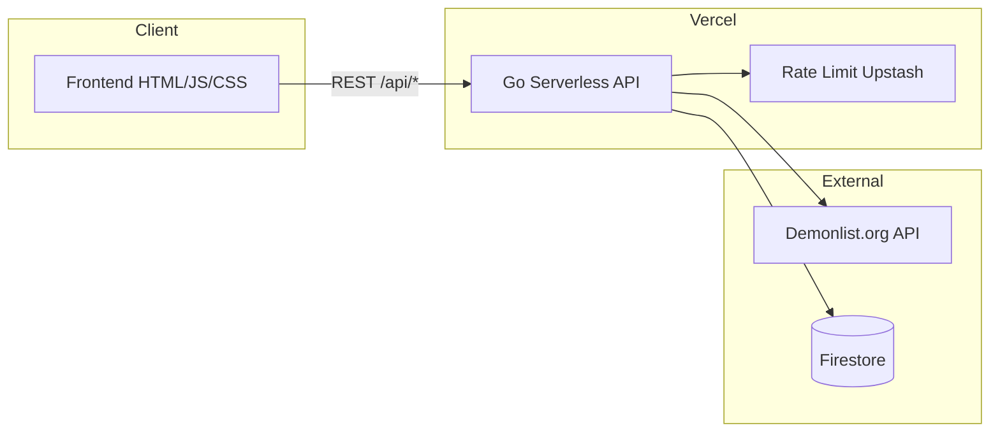

<div align="center">

# SMLT Demonlist

**Лидерборд и хаб проектов сообщества SMLT в Geometry Dash**

Актуальная статистика с [Demonlist.org](https://demonlist.org), трекер коллабов и защищённая панель хоста — в одном веб-приложении.

<br>

[](https://smltdemonlist.vercel.app)
[](https://smltdemonlist.vercel.app/demonlist.html)
[](https://smltdemonlist.vercel.app/projects.html)

<br>


[Содержание](#содержание) · [Возможности](#-возможности) · [Архитектура](#-архитектура) · [Разработка](#-для-разработчиков) · [Discord](https://discord.gg/VK56W7ZzdA)

</div>

---

## О проекте

**SMLT Demonlist** — официальный веб-сайт Discord-сообщества **SMLT**: ивенты, коллабы, турниры и прохождения уровней в Geometry Dash. Сайт показывает прогресс участников в глобальном рейтинге и помогает координировать совместные уровни.

| Страница | Что внутри |
|----------|------------|
| [Главная](https://smltdemonlist.vercel.app/) | О сообществе, ссылки, вход хоста |
| [Демонлист](https://smltdemonlist.vercel.app/demonlist.html) | Топ игроков, рекорды, hardest, флаги стран |
| [Проекты](https://smltdemonlist.vercel.app/projects.html) | Коллабы: роли, статусы, участники, превью |

> Первый заход на демонлист может занять **30–60 секунд** — данные подтягиваются с внешнего API для каждого игрока.

---

## Содержание

- [Возможности](#-возможности)
- [Скриншоты](#-скриншоты)
- [Стек](#-стек)
- [Архитектура](#-архитектура)
- [Структура репозитория](#-структура-репозитория)
- [Для разработчиков](#-для-разработчиков)
  - [Быстрый деплой](#быстрый-деплой-на-vercel)
  - [Переменные окружения](#переменные-окружения)
  - [Upstash](#upstash-redis-rate-limit)
  - [Firebase](#firebase--firestore)
  - [Локально](#локальная-разработка)
  - [API](#api)
- [Безопасность](#-безопасность)
- [Устранение неполадок](#устранение-неполадок)
- [Участие и контакты](#-участие-и-контакты)
- [Лицензия](#-лицензия)

---

## ✨ Возможности

### Демонлист

- Автоматический **лидерборд** по списку игроков сообщества
- Очки, **hardest**, рекорды и **флаги стран** из [api.demonlist.org](https://api.demonlist.org)
- **Топ уровней** с прогрессом и фильтрами
- Профили игроков без перезагрузки страницы

### Проекты SMLT

- Карточки коллабов с ролями: `HOST`, `DECO`, `GP`, `PLAYTEST`, `VERIFIER` и др.
- Статусы, комментарии, список участников
- Редактирование доступно только **хосту** (админу сайта)

### Интерфейс и админка

- Тёмная и светлая **тема**
- Адаптивная вёрстка под телефон и десктоп
- Вход **Хоста**: пароль → JWT в **HttpOnly**-куке → управление игроками и проектами в Firestore
- Тосты и плавные переходы состояний

---

## 📸 Скриншоты

Добавьте в репозиторий папку `docs/screenshots/` и положите туда изображения — они появятся на главной GitHub:

```
docs/screenshots/
├── home.png
├── demonlist.png
└── projects.png
```

Пример разметки (раскомментируйте после добавления файлов):

<!--
<p align="center">
  
</p>
<p align="center"><i>Демонлист — топ игроков и уровней</i></p>
-->

Пока скриншотов нет — откройте **[живое демо](https://smltdemonlist.vercel.app/demonlist.html)**.

---

## 🛠 Стек

| Слой | Технологии |
|------|------------|
| **Backend** | Go, Vercel Serverless (`Handler` в `api/index.go`) |
| **База данных** | Google Cloud Firestore |
| **Авторизация** | JWT (HS256) + bcrypt |
| **Rate limiting** | Upstash Redis REST (прод) / in-memory (fallback) |
| **Frontend** | HTML, CSS, Vanilla JS |
| **Внешние API** | Demonlist.org |
| **Хостинг** | Vercel |

---

## 🏗 Архитектура



**Поток данных лидерборда:** браузер → `/api/leaderboard` → для каждого ника запросы к Demonlist → JSON на фронт → таблица и профили.

---

## 📁 Структура репозитория

```
SMLT-Demonlist/
├── api/
│   ├── index.go       # Роутинг, auth, Firestore, leaderboard
│   └── ratelimit.go   # Распределённый rate limit
├── Frontend/
│   ├── index.html
│   ├── demonlist.html
│   ├── projects.html
│   ├── app.js
│   └── styles.css
├── tools/
│   └── hash.go        # Генерация bcrypt для ADMIN_HASH
├── docs/
│   └── screenshots/   # (опционально) для README на GitHub
├── vercel.json
├── go.mod
└── README.md
```

---

## 👩‍💻 Для разработчиков

Ниже — всё необходимое, чтобы **форкнуть**, **задеплоить свой инстанс** или **внести правки**.

### Требования

- [Go](https://go.dev/dl/) 1.26+
- [Vercel CLI](https://vercel.com/docs/cli) (для локального запуска)
- Аккаунты: [Vercel](https://vercel.com), [Firebase](https://firebase.google.com), [Upstash](https://upstash.com) (рекомендуется)

### Быстрый деплой на Vercel

1. **Fork** репозитория → **Import** в Vercel.
2. **Environment Variables** — см. [таблицу](#переменные-окружения) (минимум три обязательные).
3. **Deploy** → проверка:
   - `/demonlist.html` — таблица грузится
   - `/api/players` — JSON, не HTML
   - вход **Хост** — `{"success":true}`

После смены переменных: **Deployments → Redeploy**.

```bash
git clone https://github.com/YOUR_USERNAME/SMLT-Demonlist.git
cd SMLT-Demonlist
# настройте env в Vercel, затем:
git push origin main
```

### Переменные окружения

**Vercel → Project → Settings → Environment Variables → Production**

#### Обязательные

| Переменная | Описание |
|------------|----------|
| `JWT_SECRET` | Секрет JWT, ≥ 32 символа (`openssl rand -hex 32`) |
| `ADMIN_HASH` | Bcrypt-хеш пароля хоста |
| `FIREBASE_CREDENTIALS` | JSON service account Firebase (одной строкой) |

#### Рекомендуемые

| Переменная | Описание |
|------------|----------|
| `UPSTASH_REDIS_REST_URL` | REST URL Upstash |
| `UPSTASH_REDIS_REST_TOKEN` | REST token Upstash |

#### Опциональные

| Переменная | Описание |
|------------|----------|
| `TRUST_PROXY` | `true` — доверять `X-Forwarded-For` (на Vercel также при `VERCEL=1`) |

#### Генерация `ADMIN_HASH`

```bash
go run tools/hash.go "ваш_надёжный_пароль"
```

Скопируйте `$2a$10$...` в `ADMIN_HASH`. **Не коммитьте** пароль и `.env.local`.

### Upstash Redis (rate limit)

На Vercel in-memory лимит **не защищает** между инстансами — нужен Upstash.

1. [console.upstash.com](https://console.upstash.com) → **Create Database**
2. **Name:** `smlt-demonlist-ratelimit`
3. **Primary Region:** как у Vercel Functions (EU/US)
4. **Eviction:** Off · план **Free**
5. **REST API** → URL и token → переменные в Vercel → **Redeploy**

| Endpoint | Лимит |
|----------|--------|
| Все `/api/*` | 60 req/min на IP |
| `/api/login` | 10 req/min на IP |

### Firebase / Firestore

1. Firebase Console → Firestore → Service Account → **Generate key**
2. JSON → `FIREBASE_CREDENTIALS` на Vercel

| Коллекция | ID документа | Назначение |
|-----------|--------------|------------|
| `players` | имя игрока | Список для лидерборда |
| `projects` | id проекта | Коллабы |

Если Firestore пуст: **GET** leaderboard/players работает с дефолтным списком. **POST/DELETE** требуют рабочую БД.

### Локальная разработка

Секреты остаются локальными и не должны попадать в репозиторий.
`Secret/` и `.env.local` игнорируются в `.gitignore`, поэтому их можно хранить только на своём компьютере.

`.env.local` в корне (в `.gitignore`):

```env
JWT_SECRET=dev-secret-at-least-32-characters-long
ADMIN_HASH=$2a$10$...
FIREBASE_CREDENTIALS={"type":"service_account",...}
UPSTASH_REDIS_REST_URL=https://....upstash.io
UPSTASH_REDIS_REST_TOKEN=...
```

```bash
vercel link
vercel dev
```

- http://localhost:3000/index.html  
- http://localhost:3000/demonlist.html  
- http://localhost:3000/projects.html  

```bash
cd api && go build .
```

### API

База: `https://<домен>/api` · ошибки: `{"error":"..."}` · тело JSON ≤ **1 MB**

| Метод | Путь | Auth | Описание |
|-------|------|:----:|----------|
| `POST` | `/api/login` | — | Вход хоста, кука `auth_token` |
| `POST` | `/api/logout` | — | Выход |
| `GET` | `/api/auth/verify` | 🍪 | Проверка JWT |
| `GET` | `/api/leaderboard` | — | Данные Demonlist по игрокам |
| `GET` | `/api/players` | — | Список ников |
| `POST` | `/api/players` | 🍪 | Сохранить список |
| `DELETE` | `/api/players` | 🍪 | Удалить игрока |
| `GET` | `/api/projects` | — | Проекты |
| `POST` | `/api/projects` | 🍪 | Сохранить проекты |

```bash
curl -X POST https://smltdemonlist.vercel.app/api/login \
  -H "Content-Type: application/json" \
  -d '{"password":"***"}' -c cookies.txt
```

---

## 🔒 Безопасность

- Пароль хоста только как **bcrypt** (`ADMIN_HASH`)
- JWT в **HttpOnly**, **Secure**, **SameSite=Strict** куке
- Rate limit по IP (Upstash на проде)
- Валидация IP за прокси только при `VERCEL` / `TRUST_PROXY`
- JSON: `DisallowUnknownFields`, лимит размера тела
- UI: без `innerHTML` для пользовательских данных
- Секреты не в git; не логировать токены

Нашли уязвимость — создайте [Issue](issues) или напишите админу в Discord (см. ниже).

---

## Устранение неполадок

| Симптом | Решение |
|---------|---------|
| «Некорректный ответ» при входе | `JWT_SECRET`, `ADMIN_HASH`; `/api/login` должен отдавать JSON |
| Пустой лидерборд | Подождать 30–60 с; проверить `/api/leaderboard` |
| `База данных недоступна` | `FIREBASE_CREDENTIALS`, Firestore включён |
| 429 Too Many Requests | Подождать 1 мин; не брутфорсить `/api/login` |
| HTML вместо JSON на `/api` | Vercel → Logs → Functions |

---

## 🤝 Участие и контакты

### Сообщество

- **Discord:** [discord.gg/VK56W7ZzdA](https://discord.gg/VK56W7ZzdA)
- **Живой сайт:** [smltdemonlist.vercel.app](https://smltdemonlist.vercel.app)

### Как помочь проекту

1. **Star** репозитория — если проект полезен сообществу
2. **Fork** → правки → **Pull Request** с понятным описанием
3. **Issues** — баги и идеи (шаблон: что ожидали / что получили / скрин или URL)

### Команда

| Роль | Контакт |
|------|---------|
| Admin / сообщество | Discord **@.samoletik** · Telegram **@samoltik** |
| Backend & security | Discord **@rimix.98** |

---

## 📄 Лицензия

Исходный код открыт для просмотра и изучения. Коммерческое использование, форки публичных инстансов и распространение — **с согласования** с администрацией SMLT (Discord выше).

При публикации на GitHub рекомендуется добавить файл `LICENSE` (например MIT или Apache-2.0), если сообщество решит формализовать права.

---

<div align="center">

**SMLT** — Geometry Dash · коллабы · ивенты · удовольствие от игры

[⬆ Наверх](#smlt-demonlist)

</div>
